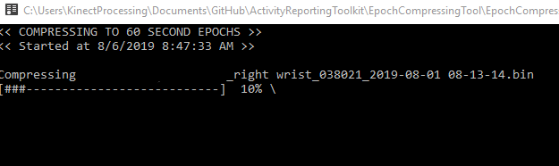
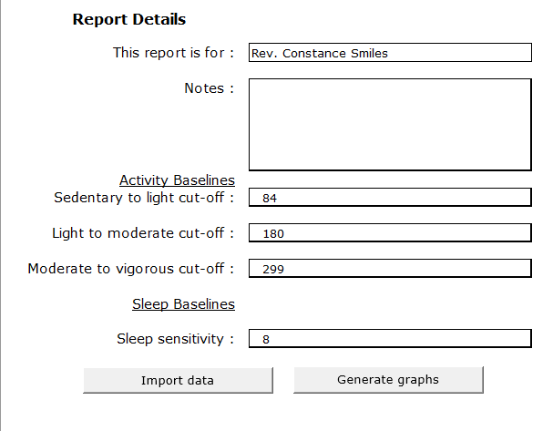

# ActivityReportingToolkit
Convert activity data to 60 second epochs for creating report and generating an easy to read printable report to display the daily activity data to participants. 

## Components to toolkit
1. EpochComptessingTool
    - Program written in C#
    - Convert the sample rate of the activity data file to 60 second epoch to make more readable in daily activity report.
    - This will run in console window, it finds the uncompressed .bin files in ```\Documents\GENEActiv\Data```
    directory location of the user.

    

    - The program will then compress the file and add it to the 
    ```\Documents\GENEActiv\Reports``` directory of the user
    - The new compressed file has the suffix 
    ```EPOCHCONVERTED.csv```

    

    - If file is already compressed it will skip

    - **These EPOCHCONVERTED.csv files are then fed into the excel reporting tool to produce the PDF reports for printing.**

2. Excel Activty Reporting Tool
    > Make sure to run the .xltm file. This is an excel template so saving any file will not change the origial file

    > After starting in excel for first time there may be a security wanting make sure you click **Enable Content**
    

    - Only edit the **User Inputs** sheet

    

    - The name you want to appear in report should be written in the "This report is for:" section

     

     - Press the import data button. A file picker dialog box will appear. Locate an EPOCH CONVERTED csv file and clicking open will load the data into the reporting tool.
     > This might take a bit as file may be large

     

     - Now the data is loaded into the other sheets like "Input csv" and "Full Data Array"

     - Now on user input sheet press the **Generate graphs** button 
      > This might take a bit as file may be large

     

     - The activity report is produced in the **ACTIVITY CHART** sheet

     

     - Printing will format pages correctly

     


